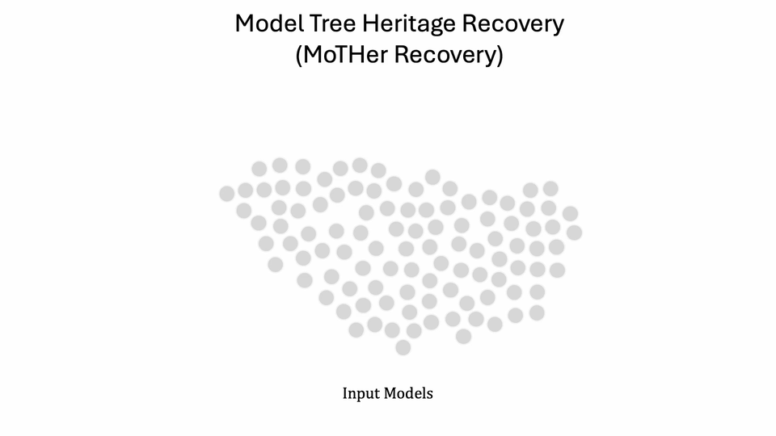

# Model Heritage Recovery (MoTHer)
Maintained by **oliver**.

- **Repo**: `https://github.com/OliverNyx/model-heritage-recovery.git`
- **Live (Vercel)**: `https://model-heritage-recovery.vercel.app`



MoTHer is a Python project for recovering *model heritage structure* (e.g., parent/child fine-tuning relationships) from a collection of model weights.

## Installation 
1.  Clone the repo:
```bash
git clone https://github.com/OliverNyx/model-heritage-recovery.git
cd MoTHer
```
2. Create a new environment and install the libraries:
```bash
python3 -m venv mother_venv
source mother_venv/bin/activate
pip install -r requirements.txt
```


## Running

- **Full fine-tuning recovery**:

```bash
python MoTHer_FullFT.py
```

- **LoRA recovery**:

```bash
python MoTHer_LoRA.py
```

- **Clustering**:

```bash
python clustering.py
```


## Notes

- This repo is set up to deploy a **static landing page** on Vercel at `model-heritage-recovery.vercel.app`.
- The Python code is intended to be run locally (or on your own compute), not inside Vercel serverless functions.
