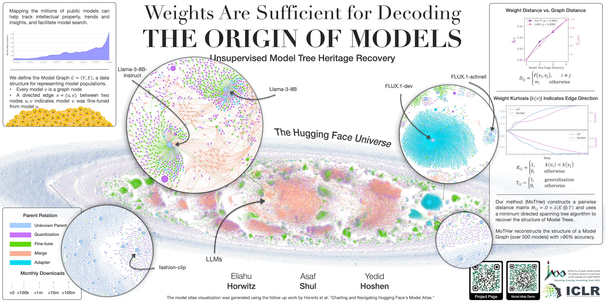

# Unsupervised Model Tree Heritage Recovery
Official PyTorch Implementation for the "Unsupervised Model Tree Heritage Recovery" paper (ICLR 2025).  
<p align="center">
    🌐 <a href="https://horwitz.ai/mother" target="_blank">Project</a> | 📃 <a href="https://arxiv.org/abs/2405.18432" target="_blank">Paper</a>| 🤗 <a href="https://huggingface.co/MoTHer-VTHR" target="_blank">Dataset</a> <br>
</p>


Our proposed *Model Graphs* and *Model Trees* are new data structures for describing the heredity training relations between models.
In these structures, heredity relations are represented as directed edges. 
We introduce the task of *Model Tree Heritage Recovery* (MoTHer Recovery), its goal is to uncover the 
unknown structure of Model Graphs based on the weights of a set of input models.
___
 
> **Unsupervised Model Tree Heritage Recovery**<br>
> Eliahu Horwitz, Asaf Shul, Yedid Hoshen<br>
> <a href="https://arxiv.org/abs/2405.18432" target="_blank">https://arxiv.org/abs/2405.18432 <br>
>
>**Abstract:** The number of models shared online has recently skyrocketed, with over one 
> million public models available on Hugging Face. Sharing models allows other users to build 
> on existing models, using them as initialization for fine-tuning, improving accuracy, and 
> saving compute and energy. However, it also raises important intellectual property issues, 
> as fine-tuning may violate the license terms of the original model or that of its training data. 
> A Model Tree, i.e., a tree data structure rooted at a foundation model and having directed 
> edges between a parent model and other models directly fine-tuned from it (children), would 
> settle such disputes by making the model heritage explicit. Unfortunately, current models are 
> not well documented, with most model metadata (e.g., "model cards") not providing accurate 
> information about heritage. In this paper, we introduce the task of 
> *Unsupervised Model Tree Heritage Recovery* (Unsupervised MoTHer Recovery) for collections 
> of neural networks. For each pair of models, this task requires: i) determining if they are 
> directly related, and ii) establishing the direction of the relationship. Our hypothesis is 
> that model weights encode this information, the challenge is to decode the underlying tree 
> structure given the weights. We discover several properties of model weights that allow us to 
> perform this task. By using these properties, we formulate the MoTHer Recovery task as 
> finding a directed minimal spanning tree. In extensive experiments we demonstrate that our 
> method successfully reconstructs complex Model Trees.

## Installation 
1.  Clone the repo:
```bash
git clone https://github.com/eliahuhorwitz/MoTHer.git
cd MoTHer
```
2. Create a new environment and install the libraries:
```bash
python3 -m venv mother_venv
source mother_venv/bin/activate
pip install -r requirements.txt
```


## The VTHR Dataset 
The ViT Tree Heritage Recovery (VTHR) dataset is a dataset that was created for the purpose of evaluating the MoTHer Recovery task. 
The dataset contains three splits: i) FT - Fully fine-tuned models, ii) LoRA-V - ViT models that were fine-tuned with LoRA with varying ranks, 
and iii) LoRA-F - ViT models that were fine-tuned with LoRA of rank 16. 

Each split contains a Model Graph with 105 models in 3 levels of hierarchy and with 5 Model Trees. 
All the models for the VTHR dataset are hosted on Hugging Face under the [https://huggingface.co/MoTHer-VTHR](https://huggingface.co/MoTHer-VTHR) organization.
To easily process all the models of a Model Graph, we provide a pickle file per script that contains the 
original tree structure and the paths for each model. The pickle files are located in the `dataset` directory.

Each of the splits is roughly 30GB in size, there is **no need** to download the dataset in advance, the code will take care of this for you.

## Running MoTHer on the VTHR Dataset 
Below are instructions to run MoTHer Recovery on the different splits. 
We start by assuming the models are already clustered into the different Model Trees. 
We will later discuss how to perform this clustering.

### Running on Model Graphs with known model clusters

#### Running on the FT Split
Run the MoTHer Recovery on the FT split:
```bash
python MoTHer_FullFT.py
```

#### Running on the LoRA Splits
Run the MoTHer Recovery on the LoRA-V and LoRA-F splits:
```bash
python MoTHer_LoRA.py
```


### Running on Model Graphs with multiple Model Trees 
When running on models from different Model Trees (i.e., a Model Graph), running the clustering is needed.
We provide a script that shows the clustering accuracy for both the LoRA-V and the FT splits.
You can change the 'LORA' flag to switch between the two splits.

```bash
python clustering.py  
```


## Citation
If you find this useful for your research, please use the following.

```
@inproceedings{
horwitz2025unsupervised,
title={Unsupervised Model Tree Heritage Recovery},
author={Eliahu Horwitz and Asaf Shul and Yedid Hoshen},
booktitle={The Thirteenth International Conference on Learning Representations},
year={2025},
url={https://openreview.net/forum?id=QVj3kUvdvl}
}
```


## Acknowledgments
- The project makes extensive use of the different Hugging Face libraries (e.g. [Diffusers](https://huggingface.co/docs/diffusers/en/index), [PEFT](https://huggingface.co/docs/peft/en/index), [Transformers](https://huggingface.co/docs/transformers/en/index)).
